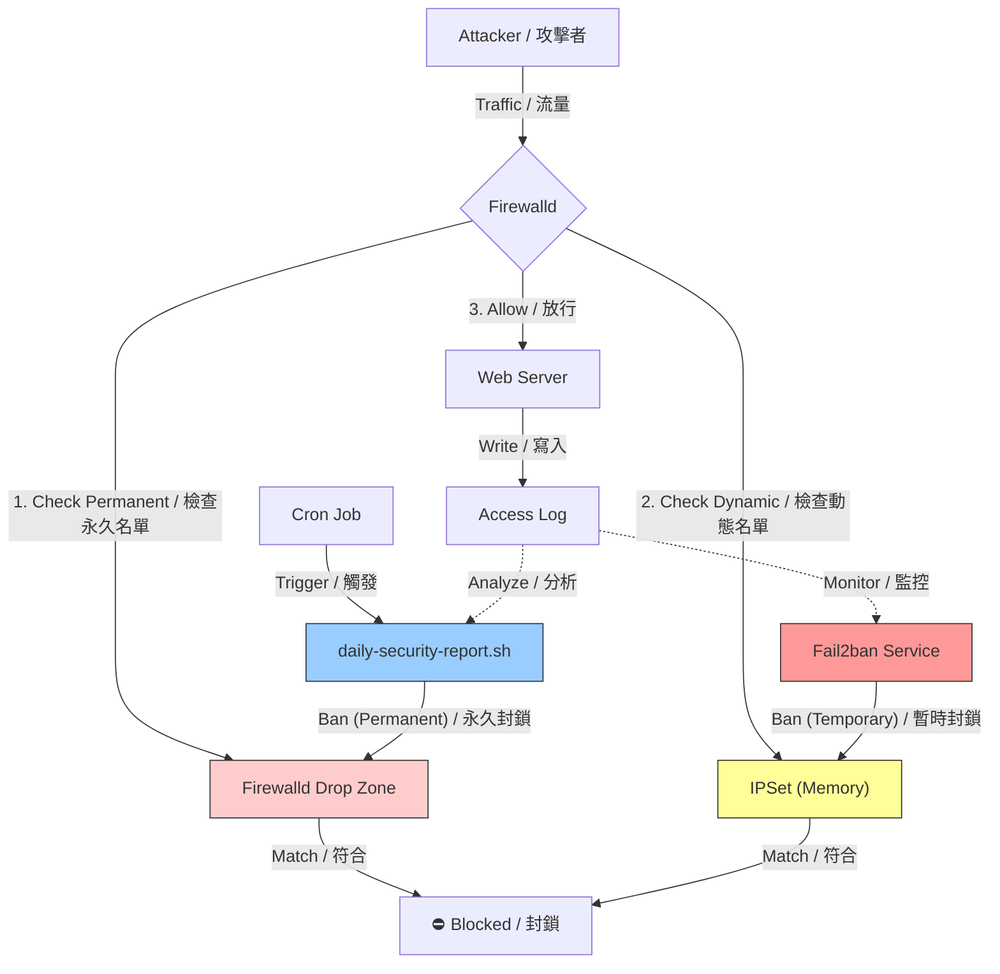

# Fail2ban-tools / Fail2ban 增強工具組

A comprehensive toolkit to enhance `fail2ban` and `firewalld` operations for Linux servers. This project provides scripts for deep log analysis, daily security reporting, intelligent IP blocking (GeoIP + Attack Patterns), and visualization of banned IPs.
這是一個用於增強 Linux 伺服器上 `fail2ban` 和 `firewalld` 運作的綜合工具組。本專案提供深度日誌分析、每日安全報告、智慧 IP 封鎖（GeoIP + 攻擊模式）以及封鎖 IP 視覺化的腳本。

> This project is based on concepts and code generated via Gemini.
> 本專案基於 Gemini 生成的概念與程式碼。

## Architecture: The Relationship between Fail2ban, IPSet, and Firewalld
## 架構說明：Fail2ban、IPSet 與 Firewalld 的關係

This project utilizes a layered defense strategy:
本專案採用分層防禦策略：



1.  **Fail2ban (The Detective / 偵探)**
    *   **Type**: **Temporary Blocking (暫時封鎖)**
    *   **Role**: Monitors logs (e.g., `httpd/access_log`) for immediate threats.
    *   **Action**: Dynamically bans IPs by adding them to **IPSet** lists (e.g., `f2b-apache-scan-error`).
    *   **Action**: Dynamically bans IPs by adding them to **IPSet** lists for a set time (e.g., 1 hour).
    *   **角色**：監控日誌（如 `httpd/access_log`）以發現即時威脅。
    *   **動作**：透過將 IP 加入 **IPSet** 清單（如 `f2b-apache-scan-error`）來動態封鎖。
    *   **動作**：透過將 IP 加入 **IPSet** 清單來動態封鎖一段時間（例如 1 小時，時間到自動解封）。

2.  **IPSet (The Database / 資料庫)**
    *   **Type**: **High-Performance Storage (高效儲存)**
    *   **Role**: Efficiently stores lists of banned IPs in kernel memory.
    *   **Benefit**: Allows blocking thousands of IPs without performance degradation, unlike standard iptables rules.
    *   **角色**：在核心記憶體中高效存儲被封鎖的 IP 列表。
    *   **優點**：允許封鎖數千個 IP 而不降低效能（不同於標準 iptables 規則）。

3.  **Firewalld (The Enforcer / 執法者)**
    *   **Type**: **Permanent & Execution (永久與執行)**
    *   **Role**: The frontend for firewall management.
    *   **Usage**:
        *   **Dynamic**: Blocks traffic from IPs listed in **IPSet** (managed by Fail2ban).
        *   **Permanent**: Scripts like `daily-security-report.sh` add persistent threats directly to the Firewalld `drop` zone.
        *   **Dynamic (Via Fail2ban)**: Blocks traffic from IPs listed in **IPSet**.
        *   **Permanent (Via Report)**: Scripts like `daily-security-report.sh` add persistent threats directly to the Firewalld `drop` zone (Permanent ban).
    *   **角色**：防火牆管理的前端介面。
    *   **用途**：
        *   **動態**：阻擋 **IPSet** 中列出的 IP 流量（由 Fail2ban 管理）。
        *   **永久**：`daily-security-report.sh` 等腳本會將持續性威脅直接加入 Firewalld 的 `drop` 區域。
        *   **動態 (透過 Fail2ban)**：阻擋 **IPSet** 中列出的 IP 流量（暫時性）。
        *   **永久 (透過報告)**：`daily-security-report.sh` 等腳本會將持續性威脅直接加入 Firewalld 的 `drop` 區域（永久封鎖，需手動解除）。

---

## Features / 功能

*   **Daily Security Report / 每日安全報告**:
    *   Analyzes HTTP logs to identify top attackers, SQL injection attempts, and scanners.
    *   分析 HTTP 日誌以識別主要攻擊者、SQL 注入嘗試和掃描器。
*   **Intelligent Blocking / 智慧封鎖**:
    *   Distinguishes between potential false positives and malicious traffic using GeoIP and attack signatures.
    *   利用 GeoIP 和攻擊特徵區分潛在的誤判與惡意流量。
*   **Visual Dashboard / 視覺化儀表板**:
    *   View currently banned IPs with their country of origin and "evidence" (attack logs).
    *   查看目前被封鎖的 IP 及其來源國家和「罪證」（攻擊日誌）。
*   **Firewalld & IPSet Integration / 整合管理**:
    *   Scripts to easily manage permanent bans via Firewalld and dynamic bans via IPSet.
    *   提供腳本以輕鬆管理 Firewalld 的永久封鎖和 IPSet 的動態封鎖。

## Prerequisites / 前置需求

*   `fail2ban`
*   `firewalld`
*   `ipset`
*   `geoip-bin` (for `geoiplookup`)
*   `goaccess` (optional / 選用)

## Scripts Overview / 腳本總覽

### 📊 Analysis & Reporting / 分析與報告

*   **`daily-security-report.sh`**
    *   **Description**: Generates a daily threat report. Analyzes top 50 IPs, checks for SQLi/scanning, and identifies ISP/Country.
    *   **描述**：生成每日威脅報告。分析前 50 名 IP，檢查 SQLi/掃描行為，並識別 ISP/國家。
    *   **Usage / 用法**:
        *   `./daily-security-report.sh`: View report (Dry Run) / 查看報告（試跑）。
        *   `./daily-security-report.sh --block`: Execute blocking / 執行封鎖。
*   **`checkban.sh`**
    *   **Description**: A "War Room" dashboard. Displays system load, Firewalld bans, and Fail2ban jail status with evidence.
    *   **描述**：「戰情室」儀表板。顯示系統負載、Firewalld 永久封鎖和 Fail2ban 監獄狀態及罪證。
    *   **Output Example / 輸出範例**:
        ```text
        === [ 1. 系統效能負載 ] ===
         21:22:34 up 18:21,  2 users,  load average: 1.82, 1.23, 0.90

        === [ 2. Firewalld 永久阻擋名單 (Zone: drop) ] ===
          [已阻擋] 34.158.168.0/24 (未知 (Unknown))
        共存取 329 次 | SQLi: 0
              └─ 關鍵路徑: /.env(6次) /wp-config.php.swp(4次) /wp-config.php.old(4次)

        === [ 3. Fail2ban 動態監獄(配合ipset) ] ===
        監獄 [apache-combined]: 5 人服刑
          - 217.182.195.0/24 (FR | AS16276 OVH SAS) [剩餘 60807s]
        共存取 100 次 | SQLi: 0
              └─ 關鍵路徑: /archiver/?tid-63911.html(3次) ...
          - 57.141.16.0/24 (BE | AS2647 Societe Internationale ...) [剩餘 54844s]
        共存取 14478 次 | SQLi: 0
              └─ 關鍵路徑: /uc/avatar.php?uid=24550&size=middle(12次) ...
        ```
*   **`firewalld-list-banned.sh`**
    *   **Description**: Lists IPs in the Firewalld `drop` zone with GeoIP info.
    *   **描述**：列出 Firewalld `drop` 區域中的 IP 及其 GeoIP 資訊。

### 🛡️ Firewall & Ban Management / 防火牆與封鎖管理

*   **`firewalld-add.sh`**: Adds subnets to drop zone & tunes sysctl. / 將網段加入 drop 區域並調整 sysctl。
*   **`firewalld-remove-all.sh`**: Clears Firewalld drop zone. / 清空 Firewalld drop 區域。
*   **`fail2ban-list-banned.sh`**: Lists IPs banned by Fail2ban. / 列出被 Fail2ban 封鎖的 IP。
*   **`fail2ban-unbanned-all.sh`**: Unbans all IPs in Fail2ban. / 解除 Fail2ban 所有封鎖。
*   **`ipset-list.sh`**: Lists active IP sets. / 列出活躍的 IP set。
*   **`ipset-add-ip.sh` / `ipset-remove-ip.sh`**: Manage IP sets manually. / 手動管理 IP set。

### 🔍 Monitoring Tools / 監控工具

*   **`httpd-log.sh`**: Tails Apache access log. / 追蹤 Apache 存取日誌。
*   **`fail2ban-log.sh`**: Tails Fail2ban log. / 追蹤 Fail2ban 日誌。
*   **`goaccess.sh`**: Runs GoAccess analysis. / 執行 GoAccess 分析。

### ⚙️ Configuration & Automation / 設定與自動化

*   **`crontab-e.txt`**: Example cron jobs for automating the daily report. / 自動化每日報告的排程範例。

## Installation / 安裝

1.  Clone the repository. / 複製儲存庫。
2.  Ensure scripts are executable / 確保腳本可執行:
    ```bash
    chmod +x *.sh
    ```
3.  **Configuration / 設定**:
    *   Edit `daily-security-report.sh` to set `WHITELIST` and log paths. / 編輯 `daily-security-report.sh` 設定白名單與日誌路徑。
    *   Ensure `geoiplookup` is working. / 確保 `geoiplookup` 正常運作。

## Automation / 自動化排程

To enable automatic daily blocking and reporting, add the following jobs to your crontab.
若要啟用每日自動封鎖與報告，請將以下排程加入您的 crontab。

1.  Open crontab editor / 開啟排程編輯器: `crontab -e`
2.  Add the following lines (adjust paths and email) / 加入以下內容（請調整路徑與 Email）:

```bash
# 1. Monthly Cleanup (1st day at 04:00) / 每月 1 號凌晨 4 點：清空防火牆舊名單
# Clears old permanent bans to maintain firewall performance.
00 04 1 * * /usr/bin/firewall-cmd --zone=drop --list-sources | xargs -n1 /usr/bin/firewall-cmd --zone=drop --remove-source && /usr/bin/firewall-cmd --runtime-to-permanent

# 2. Daily Analysis & Report (05:00) / 每天凌晨 5 點：分析 Log 並寄送報告
# Runs analysis, strips color codes, and emails the report. / 執行分析，移除顏色碼並寄送報告。
00 05 * * * /var/www/fail2ban/daily-security-report.sh | sed 's/\x1b\[[0-9;]*m//g' | /bin/mail -s "Daily Security Report - $(date +\%Y\%m\%d)" -a "Content-Type: text/plain; charset=UTF-8" yingchih.fang@gmail.com

# 3. Execute Blocking (05:15) / 每天凌晨 5 點 15 分：正式執行防火牆封鎖
# Applies the ban list generated by the report step. / 執行報告步驟產生的封鎖名單。
15 05 * * * /var/www/fail2ban/daily-security-report.sh --block > /dev/null 2>&1

# 4. Backup Report (05:20) / 每天凌晨 5 點 20 分：備份報告紀錄
# Archives the daily report. / 封存每日報告。
20 05 * * * cp /tmp/daily_attack_report.txt /var/www/fail2ban/reports/report-$(date +\%Y\%m\%d).log
```

## Disclaimer / 免責聲明

This tool performs blocking operations on your firewall. Please review the code and test in a safe environment before deploying to production.
本工具會對防火牆執行封鎖操作。請在部署到生產環境前，仔細審查程式碼並在安全環境中測試。
